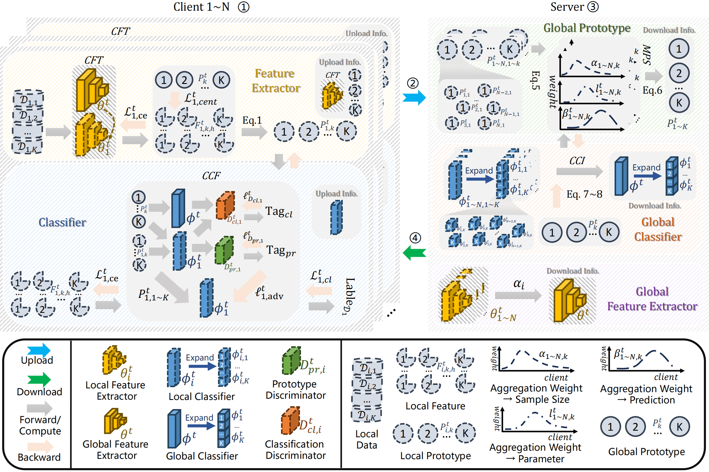

# FedMate: Choice Outweighs Effort

**Facilitating Complementary Knowledge Fusion in Federated Learning via Re-calibration and Merit-discrimination**

*Accepted by ECAI 2025*

## Overview

This repository implements FedMate, a novel federated learning framework that addresses the challenge of heterogeneous data distribution through intelligent prototype aggregation and adversarial training.

<p align="center">
    
</p>

## Key Features

- **Merit-based Prototype Aggregation**: Multi-stage fusion using sample size, quality assessment, and classifier feedback
- **Adversarial Training**: WGAN-style discriminators for improved local-global consistency  
- **Re-calibration Mechanism**: Adaptive weight adjustment based on client data quality
- **Multiple FL Algorithms**: Support for FedAvg, FedPer, Local training, and FedMate

## Quick Start

```bash
# Install dependencies
pip install torch torchvision numpy scikit-learn cvxpy

# Run FedMate on CIFAR-10
python main.py --dataset cifar10 --train_rule FedMate --num_users 10 --epochs 100

# Run with different heterogeneity settings
python main.py --dataset cifar10 --train_rule FedMate --noniid_s 20 --local_size 600
```

## Key Arguments

- `--train_rule`: Algorithm choice (`FedAvg`, `FedPer`, `Local`, `FedMate3`)
- `--dataset`: Dataset (`cifar10`, `cifar100`, `mnist`, `fmnist`, `emnist`)
- `--noniid_s`: Non-IID level (0-100, higher = less heterogeneous)
- `--num_users`: Number of federated clients
- `--afa`: Enable classifier aggregation
- `--mum`: Enable multi-level prototype fusion

## Citation

```bibtex
@inproceedings{fedmate2025,
  title={Choice Outweighs Effort: Facilitating Complementary Knowledge Fusion in Federated Learning via Re-calibration and Merit-discrimination},
  booktitle={ECAI 2025},
  year={2025}
}
```

## License

MIT License